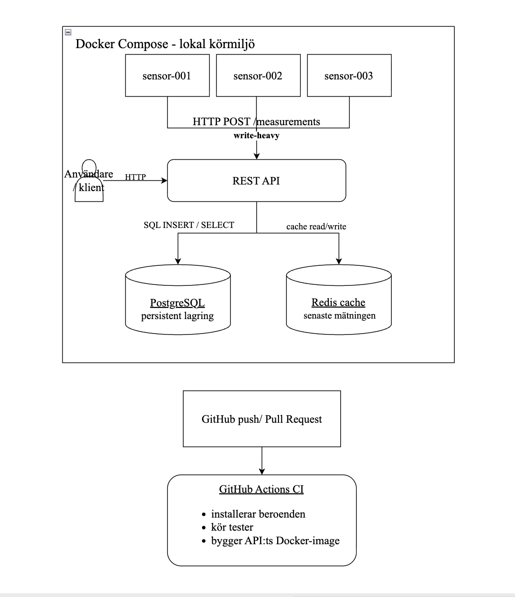
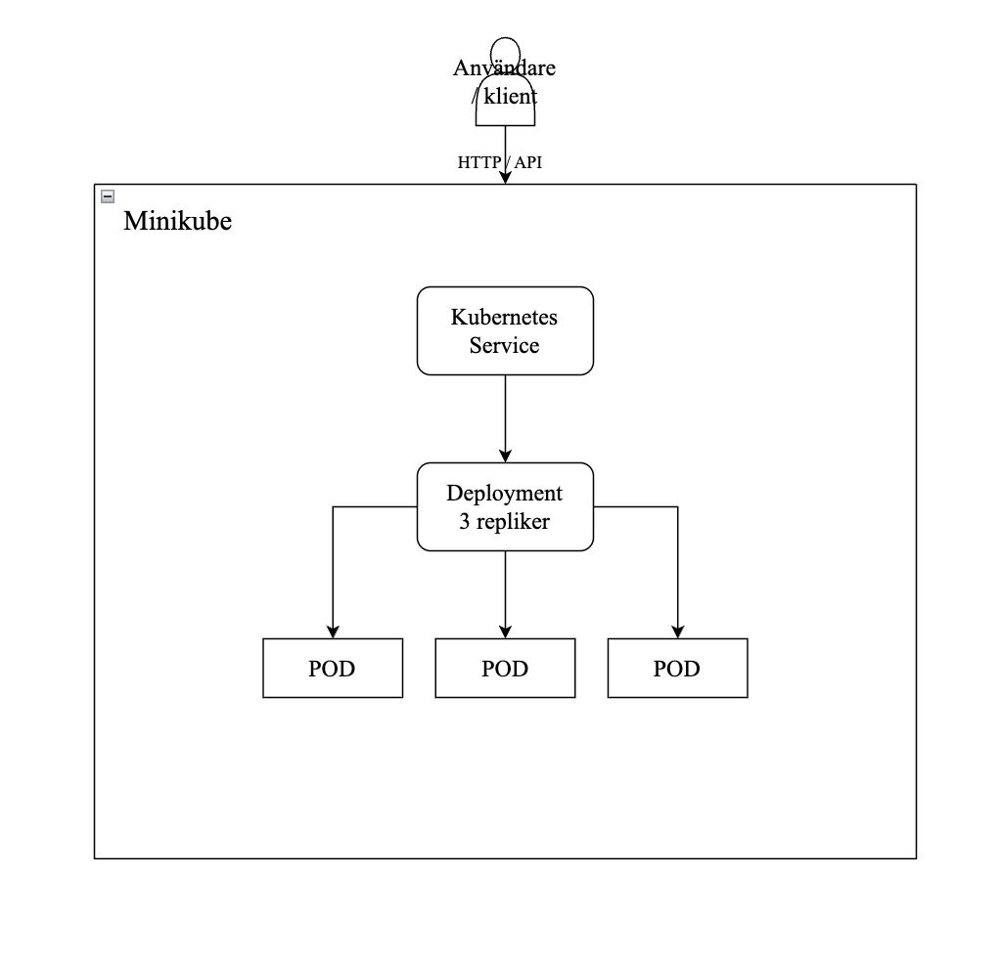

# Arkitekturdiagram

## Docker Compose och CI

Diagrammet visar den lokala Docker Compose miljön med tre simulerade IoT-sensorer, REST API, PostgreSQL och Redis. Sensorerna skickar mätningar till API:t via `HTTP POST /measurements`. Mätningarna sparas i PostgreSQL som persistent lagring, medan den senaste mätningen cacheas i Redis. PostgreSQL används för att mätningarna ska finnas kvar över tid, medan Redis används för att snabbt kunna hämta den senaste mätningen.

CI-pipelinen körs via GitHub Actions vid push och pull request. Den installerar beroenden, kör tester och bygger API:ts Docker-image.

## Kubernetes – Minikube

Kubernetes-diagrammet visar hur API:t körs i Minikube med en Service, en Deployment och tre Pod-repliker. Servicen används för att ta emot trafik till API:t och skicka den vidare till Pods. Deploymenten ser till att rätt antal Pods körs (desired state) och gör det möjligt att ändra antalet repliker. I demon testades även self-healing genom att ta bort en Pod manuellt och se att Deploymenten startade en ny.

